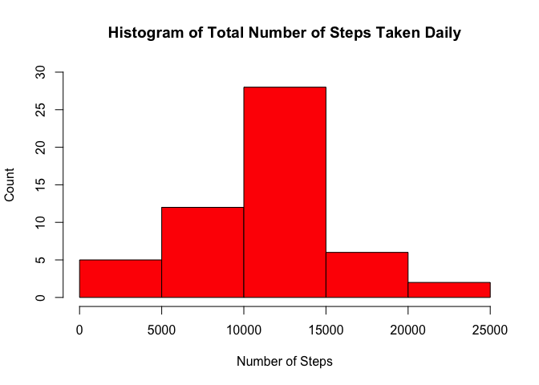
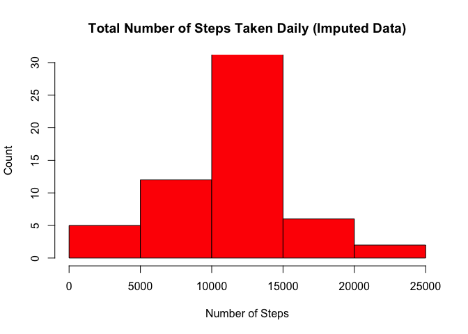
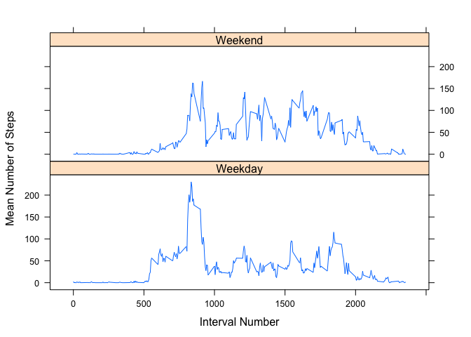

# Reproducible Research: Peer Assessment 1


## Loading and preprocessing the data
#### Load the data i.e. read.csv().

```r
setwd("~/Documents/Coursera/Assignments/RepData_PeerAssessment1")
df <- read.csv('activity.csv', sep = ',', header = TRUE)
head(df)
```

```
##   steps       date interval
## 1    NA 2012-10-01        0
## 2    NA 2012-10-01        5
## 3    NA 2012-10-01       10
## 4    NA 2012-10-01       15
## 5    NA 2012-10-01       20
## 6    NA 2012-10-01       25
```

#### Convert the date variable to POSIXct format.

```r
library(lubridate)
df$date <- ymd(df$date)
```

#### Create an aggregate file by date, with the total number of steps per day.

```r
library(reshape2)
df.date <- melt(df[, 1:2], id = "date")
df.date <- dcast(df.date, date ~ variable, sum)
head(df.date)
```

```
##         date steps
## 1 2012-10-01    NA
## 2 2012-10-02   126
## 3 2012-10-03 11352
## 4 2012-10-04 12116
## 5 2012-10-05 13294
## 6 2012-10-06 15420
```

#### Create an aggregate file by interval, with the mean number of steps per interval.

```r
df.interval <- melt(df[, c(1,3)], id = "interval")
df.interval <- dcast(df.interval, interval ~ variable, mean, na.rm = TRUE)
head(df.interval)
```

```
##   interval     steps
## 1        0 1.7169811
## 2        5 0.3396226
## 3       10 0.1320755
## 4       15 0.1509434
## 5       20 0.0754717
## 6       25 2.0943396
```


## What is mean total number of steps taken per day?
#### Plot a histogram of the total number of steps taken each day.

```r
with(df.date, hist(steps, xlab = "Number of Steps", ylab = "Count", 
                   main = "Histogram of Total Number of Steps Taken Daily", 
                   col = "red", ylim = c(0, 30)))
```

 

#### Compute the mean and median total number of steps taken per day.

```r
summary(df.date$steps)
```

```
##    Min. 1st Qu.  Median    Mean 3rd Qu.    Max.    NA's 
##      41    8841   10760   10770   13290   21190       8
```


## What is the average daily activity pattern?
#### Create a time-series plot of the 5-minute interval (x-axis) and the average number of steps taken, averaged across all days (y-axis).

```r
with(df.interval, plot(interval, steps, type = "l", lwd = 2, 
                       xlim = c(0, 2500), ylim = c(0, 250),
                       xlab = "Interval Number", 
                       ylab = "Mean Number of Steps",
                       main = "Mean Number of Steps by 5-Minute Interval"))
```

 

#### Which 5-minute interval, on average across all the days in the dataset, contains the maximum number of steps?

```r
print(df.interval[df.interval$steps == max(df.interval$steps), ], row.names = FALSE)
```

```
##  interval    steps
##       835 206.1698
```


## Imputing missing values
#### Calculate and report the total number of missing values in the dataset (i.e. the total number of rows with NAs).

```r
sum(is.na(df))
```

```
## [1] 2304
```

#### Use the means for the 5-minute intervals to fill in all of the missing values in the dataset. 

```r
df2 <- subset(df, is.na(df$steps) == TRUE)
for (i in 1:nrow(df.interval)) {
    df2$steps[df2$interval == df.interval$interval[i]] <- df.interval$steps[i]
}
```

#### Create a new dataset that is equal to the original dataset but with the missing data filled in.

```r
df1 <- subset(df, is.na(df$steps) == FALSE)
df.i <- rbind(df1, df2)
rm(list = c("df1", "df2"))
df.i <- df.i[order(df.i$date, df.i$interval), ]
head(df.i)
```

```
##       steps       date interval
## 1 1.7169811 2012-10-01        0
## 2 0.3396226 2012-10-01        5
## 3 0.1320755 2012-10-01       10
## 4 0.1509434 2012-10-01       15
## 5 0.0754717 2012-10-01       20
## 6 2.0943396 2012-10-01       25
```

#### Make a histogram of the total number of steps taken each day. and calculate and report the mean and median total number of steps taken per day. Do these values differ from the estimates from the first part of the assignment? What is the impact of imputing missing data on the estimates of the total daily number of steps?

```r
df.date.i <- melt(df.i[, 1:2], id = "date")
df.date.i <- dcast(df.date.i, date ~ variable, sum)
head(df.date.i)
```

```
##         date    steps
## 1 2012-10-01 10766.19
## 2 2012-10-02   126.00
## 3 2012-10-03 11352.00
## 4 2012-10-04 12116.00
## 5 2012-10-05 13294.00
## 6 2012-10-06 15420.00
```

```r
with(df.date.i, hist(steps, xlab = "Number of Steps", ylab = "Count", 
                   main = "Total Number of Steps Taken Daily (Imputed Data)", 
                   col = "red", ylim = c(0, 30)))
```

 

```r
summary(df.date.i$steps)
```

```
##    Min. 1st Qu.  Median    Mean 3rd Qu.    Max. 
##      41    9819   10770   10770   12810   21190
```

#### The values with imputed numbers do not differ substantially from the values with missing data. The impact of imputing missing data on the estimates of the total daily number of steps is very minimal.


## Are there differences in activity patterns between weekdays and weekends?
#### Create a new factor variable in the dataset with two levels -- "weekday" and "weekend" indicating whether a given date is a weekday or weekend day.

```r
df.i$day <- 0
df.i$day[weekdays(df.i$date) %in% c("Saturday", "Sunday")] <- 2
df.i$day[df.i$day != 2] <- 1
df.i$day <- factor(df.i$day, levels = c(1, 2), labels = c("Weekday", "Weekend"))
table(df.i$day)
```

```
## 
## Weekday Weekend 
##   12960    4608
```

#### Make a panel plot containing a time series plot of the 5-minute interval (x-axis) and the average number of steps taken, averaged across all weekday days or weekend days (y-axis).

```r
df.interval.i <- melt(df.i[, c(1, 3, 4)], id = c("interval", "day"))
df.interval.i <- dcast(df.interval.i, interval + day ~ variable, mean)

library(lattice)
with(df.interval.i, xyplot(steps ~ interval | day, type = "l",
                           xlab = "Interval Number", 
                           ylab = "Mean Number of Steps",
                           layout = c(1, 2)))
```

 

